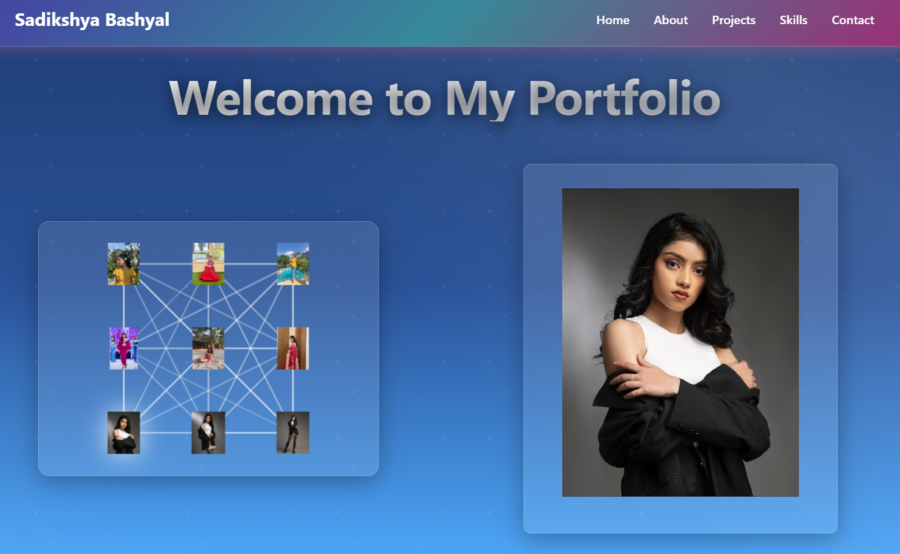

# Sadikshya Bashyal Portfolio

[🌐 Visit Portfolio](https://sadikshyabashyal.github.io)



A modern, responsive portfolio website built with React and Vite, showcasing skills, projects, and contact information for Sadikshya Bashyal.

---

## 🚀 Features

### 🌟 Landing Page
- Animated ocean wave background with floating elements.
- Eye-catching introduction and call-to-action.

### 🏠 Home Page
- Hero section with profile image, gradient circle, and floating icons.
- Social media links (GitHub, LinkedIn, Email, YouTube).
- Responsive design for all devices.

### 👩‍💼 About Page
- "Who Am I?" card with profile and introduction.
- Education card with degree and institution.
- Interests & Hobbies card with icons for fashion, coding, arts, and learning.
- "What I Do" card with skills summary and link to Skills page.

### 💼 Projects Page
- Grid of featured and recent projects.
- Project cards with images, descriptions, tech stack, and links to GitHub/live demo.
- Filter projects by category (Web, Design, All).

### 🛠️ Skills Page
- Categorized skills with progress bars.
- Overview of approach and additional skills.
- Animated, visually appealing layout.

### 📞 Contact Page
- Contact form to send messages (integrate with Formspree or similar for static hosting).
- Social links and contact details.
- Responsive and accessible design.

### 🖌️ Theming & Animations
- Consistent animated background and gradient theme across all pages.
- Floating icons and animated elements for visual interest.
- Responsive layouts and mobile-friendly adjustments.

---

## 🛠️ Getting Started

### Project Creation & Deployment

This project was bootstrapped with [Vite](https://vitejs.dev/) and React, and deployed to GitHub Pages using the `gh-pages` npm package:

```bash
npm create vite@latest my-portfolio -- --template react
cd my-portfolio
npm install
```

#### Deployment Setup
1. Install the gh-pages package:
   ```bash
   npm install --save-dev gh-pages
   ```
2. Add the following to your `package.json`:
   ```json
   "homepage": "https://sadikshyabashyal.github.io",
   "scripts": {
     "predeploy": "npm run build",
     "deploy": "gh-pages -d dist"
   }
   ```
3. Deploy to GitHub Pages:
   ```bash
   npm run deploy
   ```
4. On GitHub, go to **Settings → Pages** and set the source to the `gh-pages` branch and `/ (root)` folder.

### Running and Building

1. **Run locally:**
   ```bash
   npm run dev
   ```
2. **Build for production:**
   ```bash
   npm run build
   ```
3. **Deploy to GitHub Pages:**
   ```bash
   npm run deploy
   ```

---

## 📁 File Hierarchy

```
sadikshyabashyal.github.io/
├── my-portfolio/
│   ├── public/
│   │   ├── 1.jpeg, 2.jpeg, ...
│   │   ├── graduation-hat.svg, vite.svg
│   │   └── portfolio.png
│   ├── src/
│   │   ├── assets/
│   │   │   └── react.svg
│   │   ├── components/
│   │   │   ├── Navbar.jsx, Navbar.css
│   │   ├── pages/
│   │   │   ├── About.jsx, About.css
│   │   │   ├── Contact.jsx, Contact.css
│   │   │   ├── Home.jsx, Home.css
│   │   │   ├── Landing.jsx, Landing.css
│   │   │   ├── Projects.jsx, Projects.css
│   │   │   ├── Skills.jsx, Skills.css
│   │   ├── App.jsx, App.css
│   │   ├── index.css, main.jsx
│   ├── package.json, vite.config.js, ...
│   └── README.md
├── _config.yml
└── README.md
```

---

## 🛠 Tech Stack
- React
- Vite
- React Router (with HashRouter for static hosting)
- React Icons
- CSS (custom, responsive, animated)

---

## 📄 License
This project is for personal portfolio use. Feel free to use the template for your own portfolio with attribution.

---

## 🤖 AI Contribution

> **Template, CSS edits, and documentation were assisted and edited with AI.**
> 
> - Layout and component structure
> - CSS animations and responsive design
> - This README documentation

---